# Arquitectura del proyecto

Este documento define cómo está (o debería estar) organizado el código del proyecto,
para que cualquier persona que lo abra sepa dónde va cada cosa.

## Decisión clave: una sola app, dos flujos

El proyecto es **un solo módulo Gradle (`app`)**, no dos apps separadas. Existe un
flujo **público** (identificación de ubicación) siempre disponible, y un flujo
**protegido** (recolector/admin) que se habilita según el rol del usuario autenticado.

La separación entre "usuario normal" y "admin" se resuelve en tiempo de ejecución
mediante el estado de sesión, no mediante módulos ni APKs distintos. Esto es correcto
mientras el panel de admin siga siendo parte de la experiencia móvil; si en el futuro
el recolector creciera hasta necesitar, por ejemplo, una versión web separada para uso
interno, ahí sí tendría sentido extraerlo a un módulo o proyecto aparte.

## Patrón de arquitectura: MVVM por feature

El código se organiza por **feature/pantalla**, no por tipo de archivo. Cada pantalla
vive junto a su ViewModel porque casi siempre se editan juntos. Además se separan tres
capas:

- **`ui/`** — Composables, ViewModels, estado de UI. Es lo único que sabe de Compose.
- **`domain/`** — Modelos de negocio y casos de uso (`UseCase`). No depende de Android
  ni de Compose; es Kotlin puro.
- **`data/`** — Repositorios, acceso a red (Retrofit), cámara/sensores, sesión. Implementa
  las interfaces que domain necesita.

La regla de dependencia es: `ui → domain ← data`. La UI y la data nunca se conocen
directamente; ambas dependen de las interfaces definidas en `domain`.

## Referencia visual (mockups → pantallas)

Las 16 imágenes de referencia que definieron el alcance del proyecto están guardadas en
`assets/screens/`. Esta tabla es la fuente de verdad de qué imagen corresponde a qué
pantalla y a qué archivo de código; si el mockup cambia, actualiza también esta tabla.

### Flujo público

| # | Imagen | Pantalla | Archivo de código |
|---|---|---|---|
| 1 | 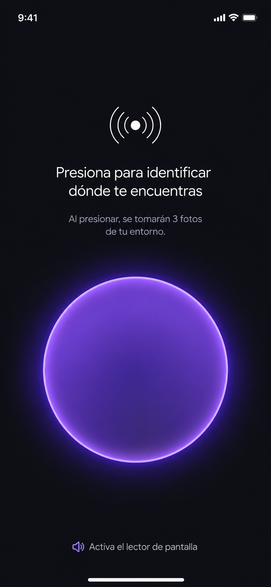 | Inicio — "Presiona para identificar dónde te encuentras" | `ui/inicio/InicioScreen.kt` |
| 2 | 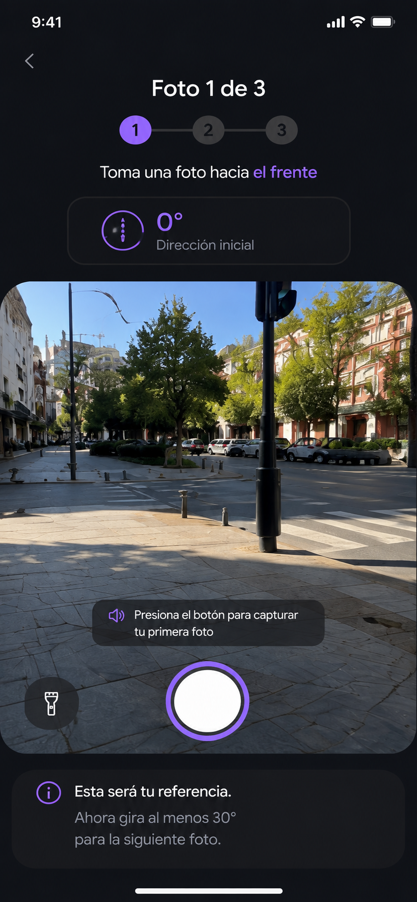 | Captura — Foto 1 de 3, dirección inicial 0° | `ui/captura/CapturaScreen.kt` |
| 3 | 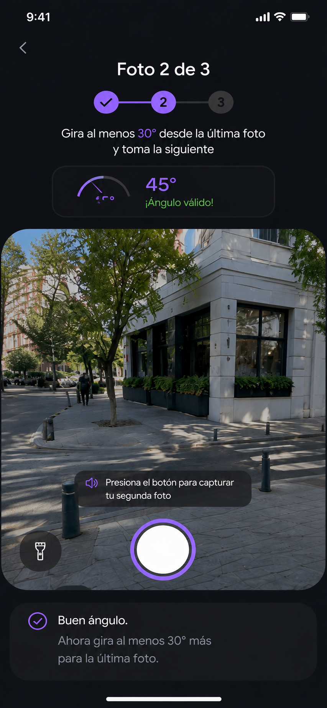 | Captura — Foto 2 de 3, validación de ángulo (45°) | `ui/captura/CapturaScreen.kt` |
| 4 | 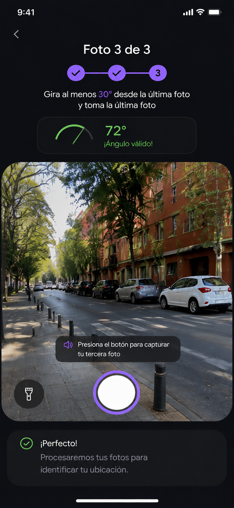 | Captura — Foto 3 de 3, ángulo válido (72°) | `ui/captura/CapturaScreen.kt` |
| 5 | 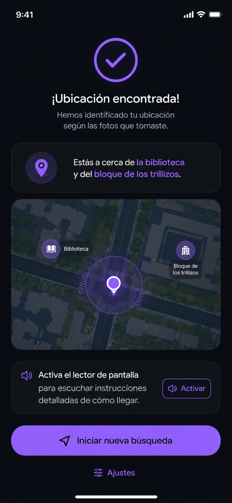 | Resultado — "¡Ubicación encontrada!" + mapa + acceso a "Ajustes" (entrada al login admin) | `ui/resultado/ResultadoScreen.kt` |

### Flujo protegido (admin / recolector)

| # | Imagen | Pantalla | Archivo de código |
|---|---|---|---|
| 6 | 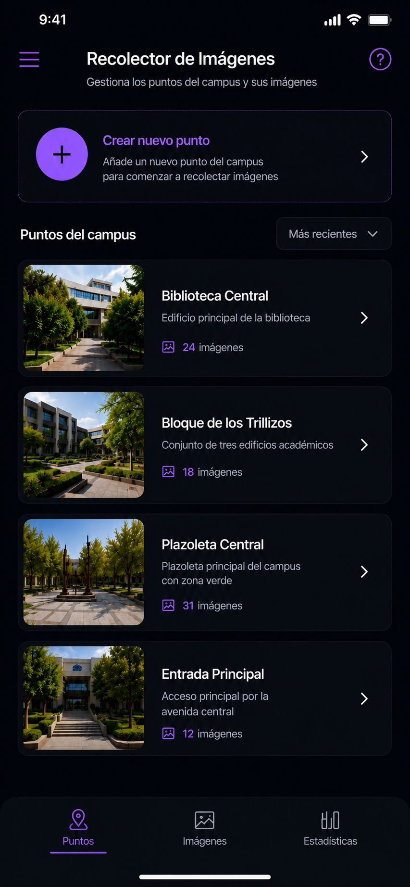 | Puntos — Lista de "Puntos del campus" + botón "Crear nuevo punto" | `ui/admin/puntos/PuntosListScreen.kt` |
| 7 | 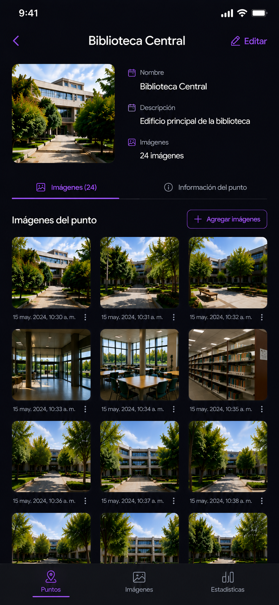 | Puntos — Detalle del punto, tab "Imágenes" | `ui/admin/puntos/PuntoDetailScreen.kt` |
| 8 | 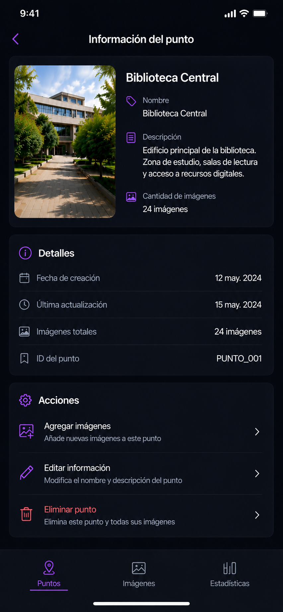 | Puntos — Detalle del punto, tab "Información del punto" (detalles + acciones) | `ui/admin/puntos/PuntoInfoScreen.kt` |
| 9 | 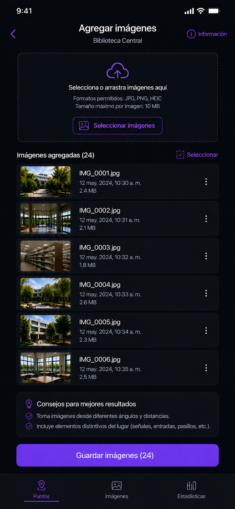 | Imágenes — "Agregar imágenes" a un punto (drag & drop / selección) | `ui/admin/imagenes/AgregarImagenesScreen.kt` |
| 10 | 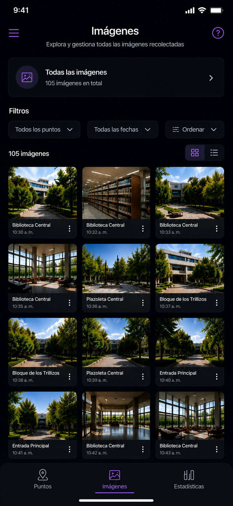 | Imágenes — Galería global con filtros (punto / fecha / orden) | `ui/admin/imagenes/ImagenesGaleriaScreen.kt` |
| 11 | 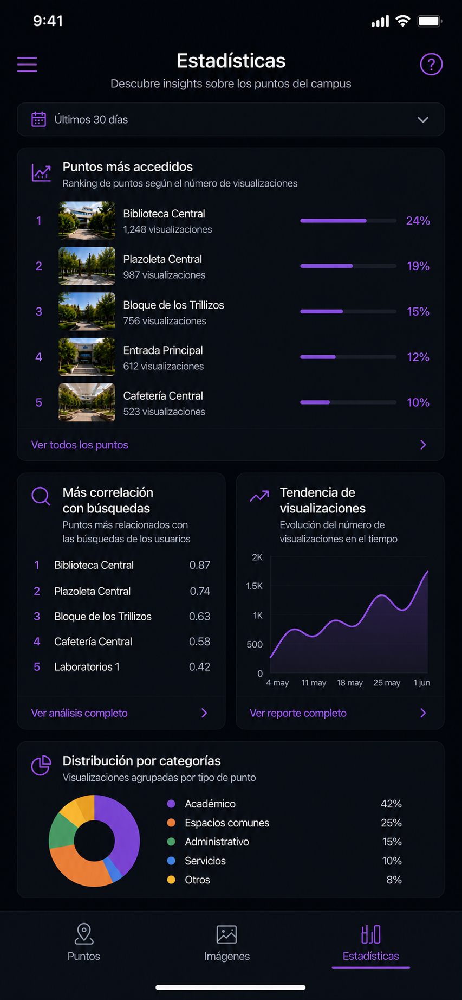 | Estadísticas — Dashboard (ranking, correlación con búsquedas, tendencia, categorías) | `ui/admin/estadisticas/EstadisticasScreen.kt` |
| 12 | 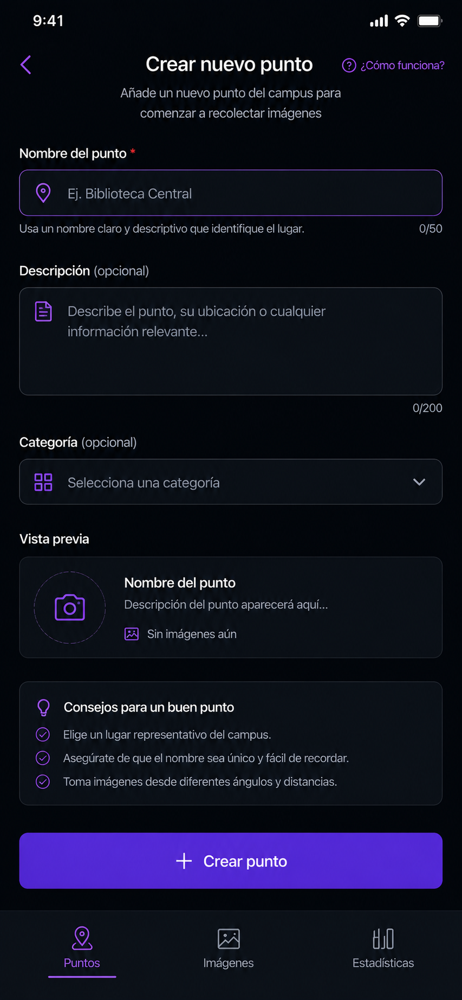 | Puntos — "Crear nuevo punto" (formulario + vista previa) | `ui/admin/puntos/CrearPuntoScreen.kt` |
| 13 | 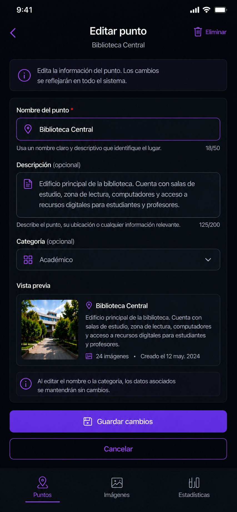 | Puntos — "Editar punto" (formulario + eliminar) | `ui/admin/puntos/EditarPuntoScreen.kt` |
| 14 | 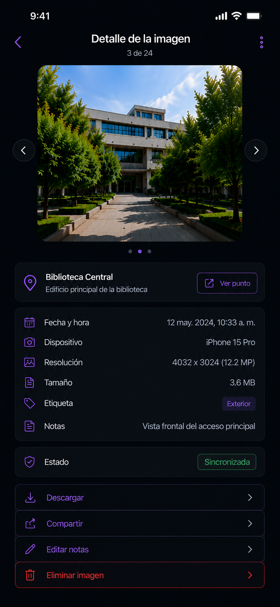 | Imágenes — Detalle de una imagen (metadata, notas, acciones) | `ui/admin/imagenes/ImagenDetailScreen.kt` |
| 15 | 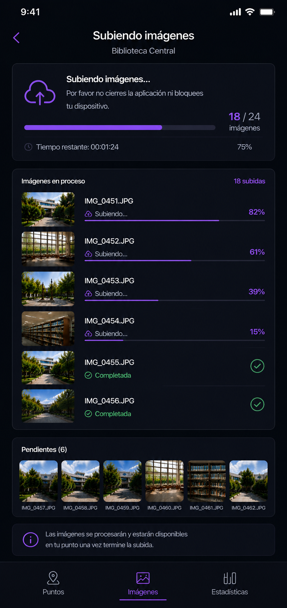 | Subida — Progreso de carga de imágenes | `ui/admin/subida/SubidaProgresoScreen.kt` |
| 16 | 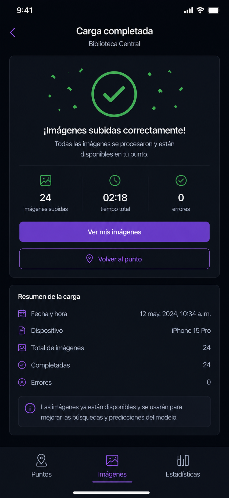 | Subida — "Carga completada" (resumen de la subida) | `ui/admin/subida/SubidaCompletadaScreen.kt` |

> Nota: las imágenes 1-5 no tienen pantallas de "Login" ni "auth" propias en los mockups
> originales — ese flujo (`ui/auth/LoginScreen.kt`) se agregó como parte de la
> arquitectura para conectar el flujo público con el admin, según lo conversado.

## Estructura de paquetes

```
com.example.myapplication/
├── MainActivity.kt
│
├── navigation/
│   ├── AppNavGraph.kt         # Grafo raíz: decide qué rutas exponer según sesión/rol
│   ├── Routes.kt              # Definición de rutas (sealed class o constantes)
│   ├── PublicNavGraph.kt      # inicio → captura → resultado
│   └── AdminNavGraph.kt       # puntos → imágenes → estadísticas
│
├── ui/
│   ├── theme/                 # Color.kt, Theme.kt, Type.kt (ya existente en el proyecto)
│   │
│   ├── inicio/                 # Img 1 — "Presiona para identificar dónde te encuentras"
│   │   ├── InicioScreen.kt
│   │   └── InicioViewModel.kt
│   │
│   ├── captura/                 # Img 2, 3, 4 — Foto 1/2/3 de 3 con validación de ángulo
│   │   ├── CapturaScreen.kt
│   │   ├── CapturaViewModel.kt
│   │   └── components/          # Indicador de ángulo, contador de pasos, etc.
│   │
│   ├── resultado/                # Img 5 — "¡Ubicación encontrada!" + mapa + puntos cercanos
│   │   ├── ResultadoScreen.kt
│   │   └── ResultadoViewModel.kt
│   │
│   ├── auth/
│   │   ├── LoginScreen.kt        # Acceso al modo admin (desde "Ajustes" en Resultado)
│   │   └── LoginViewModel.kt
│   │
│   └── admin/                     # Todo el panel "Recolector de Imágenes"
│       ├── puntos/
│       │   ├── PuntosListScreen.kt      # Img 6  — Lista de puntos del campus
│       │   ├── PuntoDetailScreen.kt     # Img 7  — Detalle + imágenes del punto
│       │   ├── PuntoInfoScreen.kt       # Img 8  — Información / metadata del punto
│       │   ├── CrearPuntoScreen.kt      # Img 12 — Crear nuevo punto
│       │   ├── EditarPuntoScreen.kt     # Img 13 — Editar punto
│       │   └── PuntosViewModel.kt
│       ├── imagenes/
│       │   ├── ImagenesGaleriaScreen.kt # Img 10 — Galería global con filtros
│       │   ├── AgregarImagenesScreen.kt # Img 9  — Agregar imágenes a un punto
│       │   ├── ImagenDetailScreen.kt    # Img 14 — Detalle de una imagen
│       │   └── ImagenesViewModel.kt
│       ├── subida/
│       │   ├── SubidaProgresoScreen.kt  # Img 15 — Progreso de carga de imágenes
│       │   ├── SubidaCompletadaScreen.kt# Img 16 — Carga completada
│       │   └── SubidaViewModel.kt
│       ├── estadisticas/
│       │   ├── EstadisticasScreen.kt    # Img 11 — Dashboard (rankings, tendencias, categorías)
│       │   └── EstadisticasViewModel.kt
│       └── components/
│           └── AdminBottomNavBar.kt     # Puntos / Imágenes / Estadísticas
│
├── domain/
│   ├── model/
│   │   ├── Usuario.kt
│   │   ├── Punto.kt
│   │   ├── ImagenPunto.kt
│   │   ├── ResultadoUbicacion.kt
│   │   └── FotoCapturada.kt
│   └── usecase/
│       ├── auth/
│       │   └── LoginUseCase.kt
│       ├── ubicacion/
│       │   └── IdentificarUbicacionUseCase.kt
│       └── admin/
│           ├── CrearPuntoUseCase.kt
│           ├── EditarPuntoUseCase.kt
│           ├── EliminarPuntoUseCase.kt
│           ├── SubirImagenesUseCase.kt
│           └── ObtenerEstadisticasUseCase.kt
│
├── data/
│   ├── auth/
│   │   ├── AuthRepositoryImpl.kt
│   │   └── SessionManager.kt          # Estado de sesión y rol (DataStore/StateFlow)
│   ├── camera/
│   │   ├── CameraController.kt        # CameraX
│   │   └── OrientationSensorManager.kt # Sensor de ángulo/rotación
│   ├── remote/
│   │   ├── api/                       # Interfaces Retrofit
│   │   ├── dto/                       # DTOs de request/response
│   │   └── NetworkModule.kt
│   └── repository/
│       ├── UbicacionRepositoryImpl.kt
│       ├── PuntosRepositoryImpl.kt
│       ├── ImagenesRepositoryImpl.kt
│       └── EstadisticasRepositoryImpl.kt
│
└── di/                                  # Módulos de inyección de dependencias (Hilt)
    ├── AppModule.kt
    ├── NetworkModule.kt
    └── RepositoryModule.kt
```

## Manejo de sesión y rol de administrador

El acceso al flujo admin se controla con un `SessionManager` que expone el usuario
autenticado (o `null` si no hay sesión):

```kotlin
// data/auth/SessionManager.kt
class SessionManager {
    private val _usuario = MutableStateFlow<Usuario?>(null)
    val usuario: StateFlow<Usuario?> = _usuario

    val esAdmin: Boolean
        get() = _usuario.value?.rol == "admin"
}
```

El grafo de navegación raíz decide qué rutas exponer según ese estado:

```kotlin
// navigation/AppNavGraph.kt
@Composable
fun AppNavGraph(sessionManager: SessionManager) {
    val usuario by sessionManager.usuario.collectAsState()
    val navController = rememberNavController()

    NavHost(navController, startDestination = Routes.INICIO) {
        // Flujo público: siempre visible
        composable(Routes.INICIO) { InicioScreen(navController) }
        composable(Routes.CAPTURA) { CapturaScreen(navController) }
        composable(Routes.RESULTADO) { ResultadoScreen(navController) }

        // Puerta de entrada al modo admin
        composable(Routes.LOGIN) { LoginScreen(navController, sessionManager) }

        // Flujo protegido: solo si el usuario autenticado tiene rol admin
        if (usuario?.rol == "admin") {
            composable(Routes.PUNTOS) { PuntosListScreen(navController) }
            composable(Routes.IMAGENES) { ImagenesGaleriaScreen(navController) }
            composable(Routes.ESTADISTICAS) { EstadisticasScreen(navController) }
        }
    }
}
```

**Importante — seguridad real vs. UX:** ocultar rutas en Compose según el rol mejora
la experiencia (evita que el usuario vea pantallas que no le corresponden), pero
**no reemplaza la validación del backend**. Cada endpoint de la API que use el flujo
de recolector debe verificar en el servidor que el token del request pertenece a un
usuario con rol admin, independientemente de lo que la app muestre u oculte.

## Convenciones generales

- **Nombres de paquete:** en minúscula, por feature (`ui.captura`, no `ui.CapturaScreen`).
- **Un archivo por Composable de pantalla principal** (`XScreen.kt`), con sus
  sub-componentes en una carpeta `components/` si son varios.
- **ViewModels** exponen un único `StateFlow<UiState>` por pantalla en vez de múltiples
  flows sueltos, para mantener el estado predecible.
- **Los `UseCase`** encapsulan una sola acción de negocio (verbo + sustantivo) y no
  conocen detalles de Compose ni de Retrofit.
- **Los `Repository`** son la única capa que sabe si los datos vienen de red, caché
  local o sensores del dispositivo.

## Próximos pasos sugeridos

1. Mover `Theme.kt`, `Color.kt`, `Type.kt` (ya existentes) a `ui/theme/` si no están ahí.
2. Definir `Routes.kt` y dejar armado el esqueleto de `AppNavGraph.kt`.
3. Implementar `SessionManager` y `LoginScreen` para validar el cambio de flujo público → admin.
4. Construir una pantalla completa de punta a punta (`InicioScreen`) para validar que
   la estructura de capas funciona antes de replicarla en el resto.